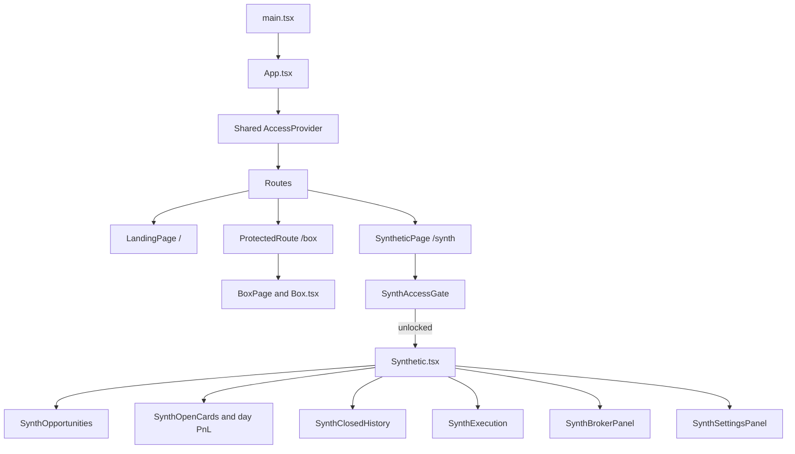
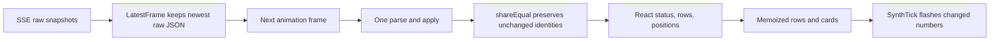

# GAR frontend: detailed working guide

**Implementation revision:** frontend repair baseline `628955c`, backend repair baseline `5f8070a` · 30 September 2026. Necessary Synth contract/status changes are included in this revision; [GitHub publication results](../tasks/2026-09-30-push-synth-repairs/STATUS.md) are recorded separately from production deployment.

This guide follows a user from opening the app through authentication, broker connection, configuration, scanning, execution, monitoring, and history. It explains which React component owns each part, which request it sends, how live state is updated, and which figures are calculated by the frontend.

The backend's full workings are covered in the [GAR system guide](https://github.com/Prakash2571/GAR_B/blob/synth/outputs/GAR_WORKING_GUIDE.md). Exact requests and all 72 runtime settings are in the [API/configuration reference](https://github.com/Prakash2571/GAR_B/blob/synth/outputs/GAR_API_AND_CONFIGURATION.md). Repair evidence and remaining integration limitations are in the [review report](https://github.com/Prakash2571/GAR_B/blob/synth/outputs/GAR_REVIEW_AND_VERIFICATION.md).

## Contents

1. [Application structure and routes](#1-application-structure-and-routes)
2. [The Synthetic access gate](#2-the-synthetic-access-gate)
3. [Transport, CSRF, errors, and timeouts](#3-transport-csrf-errors-and-timeouts)
4. [Page state and initial loading](#4-page-state-and-initial-loading)
5. [Live stream and rendering pipeline](#5-live-stream-and-rendering-pipeline)
6. [Header, status, and quick controls](#6-header-status-and-quick-controls)
7. [Opportunities and the chain view](#7-opportunities-and-the-chain-view)
8. [Open trades, quantities, and closes](#8-open-trades-quantities-and-closes)
9. [History and day P&L](#9-history-and-day-pl)
10. [Execution and live controls](#10-execution-and-live-controls)
11. [Broker connections](#11-broker-connections)
12. [Settings and confirmations](#12-settings-and-confirmations)
13. [Frontend authority, display rules, and limitations](#13-frontend-authority-display-rules-and-limitations)
14. [Development, tests, and maintenance](#14-development-tests-and-maintenance)

## 1. Application structure and routes

The frontend is a single React 18/TypeScript application bundled with Vite 6. It uses a small History API router rather than React Router. Route decisions are pure functions in [lib/routing.ts](../src/lib/routing.ts); [app/router.ts](../src/app/router.ts) handles browser history and location subscriptions.

| Path | Component path | Access and backend |
| --- | --- | --- |
| `/` | LandingPage | Public content; the shared AccessProvider probes the Box site's session. |
| `/box` | ProtectedRoute → BoxPage → Box | Site/Box access gate and TypeScript backend on port 3001. |
| `/synth` | SyntheticPage → SynthAccessGate → Synthetic | Dedicated Synthetic access gate and Go service on port 3101. |
| Unknown | Redirects to `/` | Landing page renders for the frame before the redirect effect. |

The code path is:



[main.tsx](../src/main.tsx) imports fonts/styles, applies the initial theme before rendering, mounts the app in React.StrictMode, and mounts ScrollToTop. The public page uses its dark-only theme. Box and Synthetic use the stored workspace theme, and Synthetic presents a ThemeToggle.

The shared AccessProvider wraps all routes, so a visit to `/synth` still issues the separate Box `/api/access/status` probe. That result does not gate Synthetic. The dedicated Synthetic session/CSRF module prevents a Synthetic 401 from logging the user out of the unrelated Box session.

## 2. The Synthetic access gate

[SynthAccessGate.tsx](../src/components/synth/SynthAccessGate.tsx) owns three states:

```text
checking → GET /api/synth/access/status
          → authenticated: unlocked
          → anonymous or failed probe: locked

locked → passcode form → POST /api/synth/access/verify
       → success: clear form, unlocked
       → refusal/failure: remain locked and show submit error

unlocked → render Synthetic with onLock callback
         → Synthetic 401 or Lock: locked, workspace unmounted
```

The gate renders protected Synthetic components only after authentication. While checking, it shows a spinner. While locked, it shows a password input and Unlock button. A failed initial status probe falls back to locked without a detailed outage message in that branch; a failed submit displays the transport's explanation.

The passcode exists temporarily in React state and is cleared on successful verify. The Go backend sets the HttpOnly session cookie. [api/synth.ts](../src/api/synth.ts) keeps the CSRF token in module memory, seeded from verify/status. Neither value is written to localStorage/sessionStorage by this flow.

The gate subscribes to `onSynthUnauthorized`. A protected Synthetic request returning 401 clears the Synthetic CSRF token and sets the gate locked. Unmounting `Synthetic` closes its stream and clears its execution-tab timer.

Lock calls `synthLogout`; the UI locks in a finally callback even if logout fails. Backend revocation remains necessary to end the server session: a failed logout can leave it alive despite the local locked screen. Lock also does not stop discovery or disarm backend live entries. STOP/Disarm are explicit separate controls.

## 3. Transport, CSRF, errors, and timeouts

### 3.1 Common transport and Synthetic wrapper

All calls use [api/http.ts](../src/api/http.ts). [api/synth.ts](../src/api/synth.ts) wraps it with:

```ts
request(path, description, {
  ...options,
  suppressUnauthorized: true,
  csrfToken: synthCsrf ?? ""
})
```

The underlying transport builds the API URL, sends JSON, includes cookies (`credentials:"include"`), enforces deadlines, reads the entire response body, and creates consistent error classes. Synthetic's wrapper catches a 401 to notify **its own** unauthorized listeners.

The default API origin is empty, so requests use relative `/api/synth/...` URLs. `VITE_API_BASE_URL`, when set, must be a valid http(s) origin with no embedded credentials, query, fragment, or arbitrary path; a tolerated trailing `/api` is normalized away. It is shared by Box and Synthetic, so a configured API origin must route both services if both are used.

### 3.2 CSRF lifecycle

| Action | CSRF behavior |
| --- | --- |
| Access status | Public GET; returns CSRF from the Go gate after validating the matching session/readable cookie. |
| Verify passcode | Public POST with `csrfExempt`; it creates the session/token. Wrong-passcode 401 is a submit rejection, not session expiry. |
| Protected GET | Includes session cookie, no mutation CSRF requirement. |
| Start/stop/settings/close/broker/live/delete | Synthetic module explicitly supplies its in-memory x-csrf-token. |
| Logout | Supplies Synthetic CSRF; best effort when no current token/session is available, suppressing the unrelated site unauthorized handler. |
| SSE | EventSource GET with credentials; no CSRF or access token in URL. |

The browser attaches Origin automatically. The frontend does not construct a secret credential in the URL. A missing CSRF token on an ordinary mutation is rejected locally before fetch; the backend independently checks Origin/session/CSRF.

### 3.3 Bounded waits and unknown outcomes

Default read timeout is **15 seconds**; mutation timeout is **30 seconds**. One AbortController deadline covers fetch headers and response body decoding. The wrapper distinguishes API refusal/status, timeout, network error, unreadable reply, and missing CSRF.

For a mutation, stopping the browser wait does not prove the server action failed. Unknown-outcome messages tell the operator to refresh/reconcile state before retrying. There is no automatic mutation retry in the HTTP transport. Reads can be refreshed; SSE has its own reconnection loop.

Synthetic functions are hand-written TypeScript wire types, not runtime schema decoders generated from Go. A syntactically valid JSON object is cast to its expected type; the transport does not establish that it has all nested fields. Box's generated/vendored contract checks do not cover these shapes.

## 4. Page state and initial loading

[Synthetic.tsx](../src/components/synth/Synthetic.tsx) is the orchestrator. It owns:

| State | Purpose/source |
| --- | --- |
| status | Backend running/broker/feed/storage/mode/gates/counts/day-P&L snapshot. |
| opportunities | Published, backend-ranked opportunity rows. |
| open | Open trade views including backend exit metrics. |
| history | Merged closed records fetched separately or received by exit events. |
| settings | Backend registry, current values, and version. |
| brokers | Broker session metadata and login/manual-token capabilities. |
| execView | Mode/live gates, unresolved intents, in-flight runs, calibration, and attempts. |
| view | One of opportunities/open/history/execution/brokers/settings. |
| live | Whether the browser SSE source is open/receiving snapshots; distinct from real live trading. |
| busy/closing/deleting | UI guards and action-specific feedback. |
| error/notice | Failed-request messages and action acknowledgments. |
| deletedIds | Local tombstones preventing late snapshots/history responses from resurrecting removed records. |

On unlocked mount it requests **six data groups** in addition to opening the SSE:

1. Opportunities plus status.
2. Open positions.
3. Settings registry/current values.
4. Broker metadata.
5. Today's history, using a requested limit of 1000.
6. Execution state, including the newest 50 attempts.

Those calls are independent. The stream supplies status/opportunities/open state thereafter. A failed open request is tolerated because the snapshot also carries positions; separate error state is maintained for history/execution. The active Execution tab refreshes every **3 seconds** and also after relevant execution events. History and broker tabs request fresh data on selection.

When a status snapshot reports a different `settings_version`, the page reloads settings before future edits. The actual current code does not attach a generation/order tracker to Synthetic snapshots versus initial GET replies or action replies; a slow initial response can overwrite a newer stream result. Box has a separate readiness-order mechanism that Synthetic does not use.

## 5. Live stream and rendering pipeline

### 5.1 What streams and what does not

`/api/synth/stream` sends snapshots with `status`, `opportunities`, and `open_trades`. Discrete events include entry, exit, residual, quarantine, attempt, trade deletion, and session ended.

- Snapshot updates those three primary states.
- Exit JSON merges its trade into closed history.
- trade_deleted adds a tombstone and removes the trade from open/history.
- Attempt/entry/exit/residual/quarantine request fresh execution state when the Execution tab is visible.
- Session-ended locks the page.

Settings, full broker capability metadata, closed history, and detailed execution state are not in each snapshot. Their separate requests matter, especially after reconnects.

### 5.2 Reconnection

[SynthStream](../src/lib/synthStream.ts) opens `new EventSource(url, {withCredentials:true})`. It resets its retry counter on open. On error it closes the source, reports disconnected, and makes one bounded session-status probe. A confirmed ended session locks/unmounts the page; a failed/slow probe is treated as unproven session expiry and permits reconnection.

Retry delay doubles from **1 second** to a **30-second** cap. A `session_ended` frame stops without reconnecting. Callbacks check that their source is still current, so replaced/stopped EventSources cannot deliver stale events into the page. Cleanup closes the source and cancels its reconnect timer.

Opening a stream shows “live updates” through the local `live` boolean. It does not mean the execution mode is live, orders are armed, the broker feed is healthy, or every snapshot field was just priced.

### 5.3 Coalescing and sharing



[LatestFrame](../src/lib/synthLive.ts) stores a raw string and schedules one animation-frame callback; more snapshots before it runs replace the stored string. Hidden tabs normally stop animation-frame callbacks, allowing the newest state to land when visible. Malformed JSON is dropped.

`shareEqual` matches list elements by key/id/client-order-ID/role, so ranking movement can reuse the same row object. It compares nested fields, ignores `updated_at`, `server_time`, and `evaluated_at`, and retains book-age numbers while their displayed `<1s`/seconds/minutes label stays equal. This intentionally makes retained diagnostic timestamps/age values less precise than the most recent raw payload; their display remains unchanged by that design.

Memoized `OppRow`, open cards, the history view, and P&L strip then rerender for actual displayed changes or new controls. `useDeferredValue` defers opportunity data while filters remain responsive. Cached Indian number/date formatters avoid constructing them for every cell.

There is no SSE event replay protocol or history reload on each reconnect. A disconnected tab that misses an exit can recover open state from the snapshot but keep stale closed history until it fetches history again. Malformed-but-valid JSON fields can also fail during application because no runtime Synthetic schema validates them.

## 6. Header, status, and quick controls

The header displays backend execution mode, scanning state, selected broker, theme, Lock, and RUN/STOP. The mode badge follows [modeBadge](../src/lib/synthView.ts):

| Backend state | Badge |
| --- | --- |
| Status not loaded | PAPER, with “Loading the execution mode” tooltip; this is a presentation fallback. |
| Paper mode | PAPER · TOUCH/LATENCY/LEGGING/LIVE PARITY. |
| Live with breaker | LIVE · BREAKER OPEN; takes precedence over armed. |
| Live with `live_orders:true` | LIVE · ARMED. |
| Live without it | LIVE · DISARMED. |

The Go `live_orders` field means live mode plus ARM; it is not a complete entry-permission verdict. Other blocks can still hold entries. The frontend displays the breaker/unresolved/residual/backend errors alongside the badge.

Scanning status combines RUN state, market-open status, browser stream connection, and backend feed health: Loading, Stopped, Market closed, Reconnecting, Scanning, or Feed stale. A stopped scanner may still have open trades under management.

Quick controls change server settings for ATM ±1..5, broker, execution mode, selected common lot counts, auto-entry, and auto-exit. They reuse the full registry definition and `requestChange`; risk-flagged settings first show a confirmation. The quick lots selector is a convenience subset; Settings supports the complete allowed range.

The stat strip shows watched/paired underlyings, subscribed/budgeted tokens, open/max positions, eligible count, net gate, safety, and carry rate. These counts are backend counts, not counts after browser filtering.

Prominent banners explain missing broker session, storage load, unlinked positions, market closure, stale feed, uncovered calendar, breaker, unknown orders, and residuals. Current wording has limits: the market-closed banner says no exits while the backend can perform local expiry accounting; the shared review report records this mismatch.

## 7. Opportunities and the chain view

[SynthOpportunities.tsx](../src/components/synth/SynthOpportunities.tsx) receives the backend's published rows and adds **view filters**, defaulting to best per symbol, both directions, no positive-only filter, and no search.

Filters include direction, first/best row per underlying, gross > 0, and uppercased symbol search. They do not modify the scanner watchlist, cancel an entry, or affect backend eligibility. Best per symbol chooses the first row remaining in backend order after direction/positive/search filtering.

Each row shows underlying/index marker, direction, expiry/days, K/ATM offset, listed future, executable synthetic, lock/unit, carry/unit, quantity, gross, entry/estimated-exit fees, expected net, depth age, and status/blocker.

Expanded rows show the backend timestamp basis, dispersion and coherence. `quote_max_dispersion_ms=2000` is a runtime setting independent of per-leg age (`15000`) and feed health (`10000`). Kite exchange snapshot timestamps retain whole-second resolution; Dhan/mixed availability uses receipt time for every leg. Last-trade time is not depth time. Incoherent/future/missing/invalid timestamp reasons are labeled without inventing precision. Every leg must advance between counted confirmations; UI recomputation never adds a confirmation.

The status renderer combines ELIGIBLE with `entry_blocked`; an eligible unblocked row says “entering.” That is an interpretation of the row annotation, not a broker acknowledgement. Actual entry/positions/runs remain the evidence.

Clicking a row expands the three legs: order side, exact price used, bid/ask and quantities, touch quantity, age, and reject reason. It also shows mid-basis as context, the net threshold, safety, and slippage allowances.

View chain fetches `GET /api/synth/chain/{underlying}` once. The chain panel shows the current watched ATM window and computes each displayed **mid synthetic** as `K + midpoint(CE) − midpoint(PE)` when positive bid/ask exist. That number is for inspection; it does not replace executable entry math. The panel does not subscribe its chain state to subsequent snapshots or poll automatically, and current responses are not guarded against an older request overwriting a newer chain selection.

The backend default caps nonpriority publication around 150 rows while evaluating all rows. Browser “best per symbol” operates only on transmitted rows, so it is not a query of every backend opportunity.

## 8. Open trades, quantities, and closes

[SynthOpenCards](../src/components/synth/SynthPositions.tsx) renders backend open-position projections. Each card includes the original broker/mode/direction/strike/expiry, full intended quantity, leg fills, entry economics, current MTM/touch P&L, margin source, and exit thresholds.

State priority is settlement pending, recovery required, quarantine, pending entry, residual, closing, open. Cards show saved broker account (or unverified), unknown entry prices, held/filled/closed quantities and pending/recovery instructions. Pending obligations disable Close/Flatten; over-reduction remains visible as inverse exposure and never displays as flat.

For paper-touch, the card checks recorded book evidence: an entry/exit price counts as at best only when it equals the relevant recorded touch within tolerance, full quantity was there, and the book was uncrossed. Missing evidence stays “not recorded.” This is a display consistency check on a simulated fill, not exchange fill proof.

For other modes, held/filled/closed quantities come from the trade's executions. The expandable run tables show submitted quantity, filled quantity, fixed limit, average fill, reference, slippage, status/reason, broker ID, and detection-relative timings. Entry, unwind, and each closing/flatten run remain visible.

Close now posts the trade ID; it does not choose a replacement mode:

- Paper-touch returns a closed trade synchronously (200), and the UI merges it into history.
- Other modes return 202 and `async:true` while orders are worked. The UI shows an acknowledgement and waits for the resulting open/exit stream state.
- A residual's button becomes Flatten now and resumes known residual flattening.
- Quarantine disables Close until reconciliation.
- Recovery required and settlement pending disable Close/Flatten. The backend independently refuses reductions; pending quantities and ownership remain visible across restart.

Live expiry is **settlement pending**, including partial/residual positions. `settlement_estimate_gross` is separate from realized fields, which remain null until final evidence. History labels `pnl_status`: paper estimate, observed fills with estimated charges, or `confirmed_statement`. `EXPIRED` is a paper expiry estimate; confirmed live settlement uses `SETTLED_CONFIRMED`.

The API exports `bindSynthAccount` and `reconcileSynthSettlement` for the existing authenticated transport. These full-role audited actions require explicit statement references, account/kind/contract quantities, source/note and typed confirmation; physical settlement needs delivery obligations resolved. Optional final statement order evidence uses the shared quantity/identity validation and commits atomically with settlement when REST history is unavailable. The current UI displays pending instructions but has no statement-upload/confirmation form. Operators follow the [existing API/runbook procedure](https://github.com/Prakash2571/GAR_B/blob/synth/outputs/GAR_WORKING_GUIDE.md#125-upgrade-to-durable-execution-and-settlement-authority). No automated broker settlement proof is available; repeated identical confirmation is idempotent and conflicting evidence is refused.

Close all first displays a confirmation, then reports separately which records closed, which asynchronous closes started, and which were held/refused. It is not an atomic basket across trades.

Delete is disabled for **open live** cards. For open paper/closed records a confirmation includes expected status and optional reason. On success the UI removes it and applies tombstones; on a status change the backend refuses. A deleted open paper trade stops simulated monitoring; this is different from booking a close.

## 9. History and day P&L

### 9.1 Live P&L strip

The day strip renders backend `status.day_pnl`: open LTP mark, open net if closed at touches, realized closed-today net with gross/fees, total net, and recorded open margins. Counts identify unmarked, unpriced, and unknown-margin positions excluded from totals.

This strip includes paper and live records together. “Day” uses the backend's IST close-date grouping and open entry basis; it is not a daily MTM reset for an overnight position. The live risk limit uses a different live-only backend sum.

### 9.2 Closed-history state

On initial mount the page fetches today's records. Selecting Closed trades fetches today then all, using a requested limit of 1000. Exit events merge records by ID; deleted IDs are excluded. Newer incoming records replace prior copies, and the result sorts newest closed timestamp first.

The component groups rows by IST close day, opens today's group by default, and calculates group gross/fees/net from the rows it holds. The tab total likewise sums loaded history, so it is bounded by retrieved history and can differ from a complete account ledger.

Each row shows underlying, direction, strike, original broker/mode, exit reason, margin, locked entry edge, fees, gross/net, and fill evidence. Paper-touch expands recorded entry/exit books; executor modes expand run timelines. Expired positions show the model's exit note rather than pretend a recorded exchange exit exists.

History is not part of snapshots. A stream interruption that loses an exit needs a later history fetch to fill the gap. Late-response tombstones prevent deletion reversal locally, but plain initial GET/action responses do not use a consistent generation fence against every newer snapshot.

## 10. Execution and live controls

[SynthExecution.tsx](../src/components/synth/SynthExecution.tsx) provides mode selection, paper leg-order selection, summarized execution settings, live server consent/gates, ARM/DISARM, breaker reset, unresolved orders/reconciliation, in-flight runs, and attempts.

Mode choices come from backend execution state/registry: paper_touch, paper_latency, paper_legging, paper_legging_live_parity, live. Live is disabled in the selector when the fetched server consent disallows it. The server independently rejects unsupported live configuration; a stale UI cannot grant consent.

Paper leg order can be hedge sequential or parallel. Live always orders sequentially. Readonly consent fields show global/broker enable flags, static-IP attestation, and hard margin ceiling. Timing/risk knobs link to Settings for edits.

ARM is offered when the backend's standing consent/mode/session/breaker/intents/quarantine gates report ready. Lots/open/daily-loss limits are shown too, but are entry limits rather than the client predicate for offering ARM. A dialog requires the exact server-provided phrase **ARM LIVE**, which the backend checks again under full access.

Disarm stops new live entries. RESET requires its typed phrase and clear unresolved/quarantined/in-flight state, and leaves live disarmed. Reconcile rereads broker orders and rebuilds affected trades; the UI applies returned execution/status/open state and reports how many orders remain unproven.

The unresolved-order table shows client ID, phase, instrument/side, quantity/limit, tag, intent state, broker ID, observed fills, and reason. A cancel request or a locally timed-out HTTP operation is not displayed as proof the broker order is flat.

The API intent type also includes `priced_qty`/`priced_avg_price`, the last consistent cumulative price evidence retained by the service through unpriced or contradictory updates. These diagnostic fields are separate from the current filled quantity/average and do not authorize a close in the browser.

Calibration shows clean ACK/cancel samples and medians available after 20 samples. It explains the data used by live-parity simulation; samples reset with backend restarts.

In-flight operations list kind, underlying, mode, and age. Attempt rows show detected versus filled net, outcome/reason, legging P&L, and expandable entry/unwind runs. Current paper-touch fast entries do not populate the attempt ring, despite the intended “every mode” terminology.

The tab polls every 3 seconds and refetches on relevant execution events. Concurrent requests are not serialized/generation-ordered, so a slower prior response can temporarily replace a newer one; backend state remains authoritative on every operation.

## 11. Broker connections

[SynthBrokerPanel.tsx](../src/components/synth/SynthBrokerPanel.tsx) renders a card for Zerodha and Dhan, independent of Box broker sessions. It displays connected reason, identity, login date/source, expiry, current scanner selection, and whether server app credentials support a login redirect.

Login calls the Go start endpoint and follows the backend-returned `login_url` with `window.location.assign`. The frontend never generates broker OAuth state or exchanges broker codes. Go callbacks store the token and redirect back to `/synth`.

Paste token keeps the user-entered value briefly in a password input, sends it with optional client ID/API key, clears it after success, and displays returned metadata. The backend validates with a broker profile call before encrypted storage. Existing saved tokens never come back in status responses.

Disconnect posts the broker logout; it clears that broker's token, rather than the workspace access cookie. Use broker changes the runtime broker setting with its risk confirmation. Connecting alone does not select/ARM/RUN.

Every token upload, OAuth callback, logout and direct vault mutation shares a durable account barrier with live claim/intent creation. Same-account renewal is allowed; different-account replacement/logout under exposure, unresolved orders or settlement pending returns `account_locked`. Legacy owners require audited statement binding and token renewal; the current login is never assigned silently. The UI renders backend errors and retains the existing session/CSRF paths.

### Known callback integration problem

`main.tsx` unconditionally calls the shared Box `captureBrokerLoginOutcome` and strips callback query parameters **before React mounts**. `Synthetic.tsx` later calls its separate `parseBrokerLoginResult(window.location.search)` and therefore sees no result. The Synthetic notice and automatic Brokers-tab selection can disappear, and the captured Box outcome may later be consumed by Box's panel.

This was reproduced without broker contact: feeding `?broker_login=zerodha&status=connected` through the bootstrap capture produced an empty search and a null Synthetic parser result. Session metadata still comes from the backend's Brokers endpoint; the notice loss does not itself mean login failed.

## 12. Settings and confirmations

[SynthSettingsPanel.tsx](../src/components/synth/SynthSettingsPanel.tsx) renders the backend registry dynamically. Each definition carries key, group, label/help, kind, default, current value, optional bounds/step/unit/options, risk flag, and list-item type. A newly published registry field appears without a dedicated UI component when it fits those existing kinds.

| Kind | UI behavior |
| --- | --- |
| bool | Accessible switch requesting the opposite authoritative value. |
| enum | Select from published options. |
| int/number | Draft input, min/max/step, Apply or Enter; Escape restores the current value. |
| list | Textarea draft parsed as list entries and checked against the list kind. |

The component reseeds a draft when the authoritative value changes. `parseDraft` prechecks list/boolean/numeric forms, integer/range bounds, and returns a canonical typed value for submission. Go validates again and canonicalizes symbols/dates/deduplication.

`requestChange` opens a risk confirmation when `setting.risk` is true; otherwise it immediately submits. The PATCH body is `{version: settings.version, changes:{[key]:value}}`. The page uses the returned settings/status on success; a 409 triggers a settings reload and displays the refusal.

Saving is not optimistic in the frontend: it waits for the backend's accepted authoritative set. Multiple setting changes can be posted atomically by the API, although the generic UI typically submits one definition at a time.

The frontend dialog does not add a server-enforced confirmation credential to PATCH. Server restrictions are registry type/bounds, consent, settings version, and live cross-checks. Typed live ARM/RESET are separate endpoint requirements.

## 13. Frontend authority, display rules, and limitations

Backend fields control eligibility, fills, mode, arming, prices/P&L, and permission on each action. The browser never changes an ELIGIBLE threshold locally, derives live consent, or submits arbitrary broker orders.

The frontend still has legitimate presentation calculations:

- Local filters and first-per-symbol selection over published rows.
- Contextual midpoint synthetic prices in a fetched chain.
- Group/history net/gross/fee sums.
- Checks that recorded paper-touch prices/quantity agree with recorded books.
- Filled/closed/held quantity display and legacy paper-touch fallbacks.
- Human labels, time/expiry/Indian-number formatting, CSS sign classes, and state-priority badges.

Null values display as a dash/not recorded/fetching/unavailable rather than a fabricated price. Aggregates may sum only priced contributors, with counters where the backend supplies them. Paper fills and live broker runs have different evidence displays.

Important limits are: no generated/runtime Synthetic contract validation; no generation ordering between all asynchronous state sources; callback notice interference; no history rebuild on stream reconnect; loading PAPER/default presentation before status; and stream/session cleanup does not imply backend STOP. Detailed evidence and implications are in the review report.

## 14. Development, tests, and maintenance

### 14.1 Development topology

[vite.config.ts](../vite.config.ts) listens on 5173 and maps `/api/synth` to 3101 **before** the general `/api` → 3001 rule. It preserves the browser Origin with `changeOrigin:false`; it requests identity encoding for streamed responses. In production use the same-origin nginx mapping and SPA fallback from the backend deploy configuration.

With dependencies/tooling available, `npm run dev` runs Vite, `npm test` runs Node tests with type stripping, and `npm run build` performs TypeScript + Vite build + built-asset verification. That verification checks that built CSS/HTML references and public assets exist in dist.

No `VITE_*` passcode or broker secret is required. A public build-time variable cannot protect access. SYNTH server Origin must match the exact browser scheme/host/port used in development or production.

### 14.2 Historical documentation checks

Existing Node binary used: `/home/prakash/gar-testenv/node-v22.23.2-linux-x64/bin/node`.

| Command from frontend root | Result |
| --- | --- |
| `.../node --experimental-strip-types --test tests/synthApi.test.mjs tests/synthExecution.test.mjs tests/synthLive.test.mjs tests/synthView.test.mjs` | Exit 0: all four files passed. |
| `.../node --experimental-strip-types tests/synthApi.test.mjs` | Exit 0: 5 assertions passed. |
| `.../node --experimental-strip-types tests/synthExecution.test.mjs` | Exit 0: 8 assertions passed. |
| `.../node --experimental-strip-types tests/synthLive.test.mjs` | Exit 0: 6 assertions passed. |
| `.../node --experimental-strip-types tests/synthView.test.mjs` | Exit 0: 8 assertions passed. |
| `.../node contract/verify.mjs` | Exit 0: Box contract version 1.23.0; 52 schemas verified. |
| `.../node --experimental-strip-types --test tests/*.test.mjs` | Exit 1: 34 of 36 files passed; Box DOM dependency missing, contract-negative-controls child output empty. |

The table preserves the original documentation-only session's results, not the current repair validation. Its abbreviated prefix is the historical path stated above. The current repair downloaded declared dependencies into approved backend scratch. `npm run build` passed TypeScript, Vite and all 16 asset checks; `node contract/verify.mjs` passed the unchanged Box pin. The installed Node 22.22.1 lacks native TypeScript stripping, so its direct test invocation failed `ERR_NO_TYPESCRIPT`; all four focused Synth files passed with the approved TypeScript scratch loader. Exact final results are recorded in the companion task and backend review report. No real broker or production action occurred.

The focused suites verify pure transport/CSRF/view/stream/formatting behavior with stubs and source checks. They do not mount `main.tsx` through the entire broker-return journey; that is why the reproduced callback collision can exist while the parser unit tests pass.

### 14.3 Maintaining frontend/backend integration

When changing Go view/route shapes, update `src/api/synth.ts` and the callers/tests together. Preserve the distinction between session 401, CSRF/refusal, temporary service failure, and unknown mutation outcome. Keep trade mode/filled quantities sourced from the record, and distinguish browser stream connectivity from broker feed/live permission.

Account/disconnect, execution recovery and settlement evidence are now protected in the Go service, with necessary UI types/labels and focused regressions. Remaining frontend work includes callback capture at bootstrap, ordering delayed REST/snapshot replies and repairing missed history after reconnect; these are outside the six service findings and retained in the review report. The Box contract remains unchanged.
